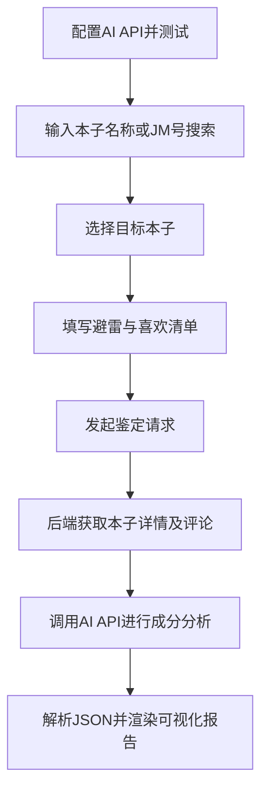

## 1. 产品概述
本项目是一个名为“AI JM本子成分鉴定”的网页应用，旨在通过接入JM Comic API和AI大模型（如OpenAI、Gemini），帮助用户在阅读前鉴定同人志或漫画中是否包含其“避雷”或“喜欢”的内容元素，从而保护读者的阅读体验。

## 2. 核心功能

### 2.1 功能模块
1. **AI配置模块**：自定义API地址、模型型号、API Key（支持OpenAI和Gemini格式），并提供连通性测试。
2. **本子搜索与选择模块**：统一的搜索框，支持通过本子名称或直接输入JM号进行搜索，并在结果列表中进行选择。
3. **偏好设置与鉴定模块**：自定义“避雷”与“喜欢”的元素标签，发起鉴定请求，并渲染结构化、可视化的鉴定报告。

### 2.2 页面详情
| 页面名称 | 模块名称 | 功能描述 |
|-----------|-------------|---------------------|
| 首页 | AI配置区 | 输入API Base URL、Model、API Key，测试连接并保存。处理深度思考模型的输出（隐藏思考过程）。 |
| 首页 | 搜索区 | 搜索框支持名字和JM号搜索。名字搜索显示封面图、标题、JM号；JM号搜索仅显示标题和JM号。 |
| 首页 | 偏好设置区 | 两个输入区域，分别用于输入“避雷清单”和“喜欢清单”（逗号分隔，可自定义）。 |
| 首页 | 鉴定报告区 | 展示AI返回的鉴定结果。命中避雷元素标红，命中喜欢元素标绿，未命中标灰。Reasoning字段支持Markdown渲染。 |

## 3. 核心流程
1. 用户在设置中配置并测试AI API。
2. 用户在搜索框输入本子名称或JM号，获取本子信息并选择目标本子。
3. 用户输入/确认“避雷”和“喜欢”的元素清单。
4. 系统通过后端API获取目标本子的标题、简介、标签及前20条高赞评论。
5. 系统组合提示词并请求AI模型，强制要求输出JSON格式。
6. 系统解析AI返回的JSON数据，渲染可视化鉴定报告。

## 4. 用户界面设计
### 4.1 设计风格
- **主色调**：深色模式（Dark Mode）为主，突出二次元与极客属性，背景采用深灰或藏青色。
- **辅助色**：红色（代表避雷/警告）、绿色（代表喜欢/安全）、灰色（代表未命中/中性）。
- **组件风格**：现代化、圆角（Rounded）、玻璃拟物化（Glassmorphism）或简洁卡片式布局。
- **字体**：无衬线字体（如 Inter, PingFang SC），确保阅读清晰。
- **布局**：响应式网格布局，信息层级分明，配置区可折叠或放置在侧边栏/弹窗中。

### 4.2 页面设计概览
| 页面名称 | 模块名称 | UI元素设计 |
|-----------|-------------|-------------|
| 首页 | 顶部导航/配置栏 | Logo、标题、AI配置入口按钮（点击弹窗） |
| 首页 | 主体-搜索区 | 居中大搜索框，带搜索图标，下拉展示搜索结果列表 |
| 首页 | 主体-偏好区 | 两个明显的Tag输入框（红绿主题），支持回车生成Tag |
| 首页 | 主体-报告区 | 卡片式展示结果，标签带颜色高亮，Markdown渲染区带适当的排版样式 |

### 4.3 响应式要求
优先桌面端体验（Desktop-first），适配移动端（单列布局，优化触控区域）。