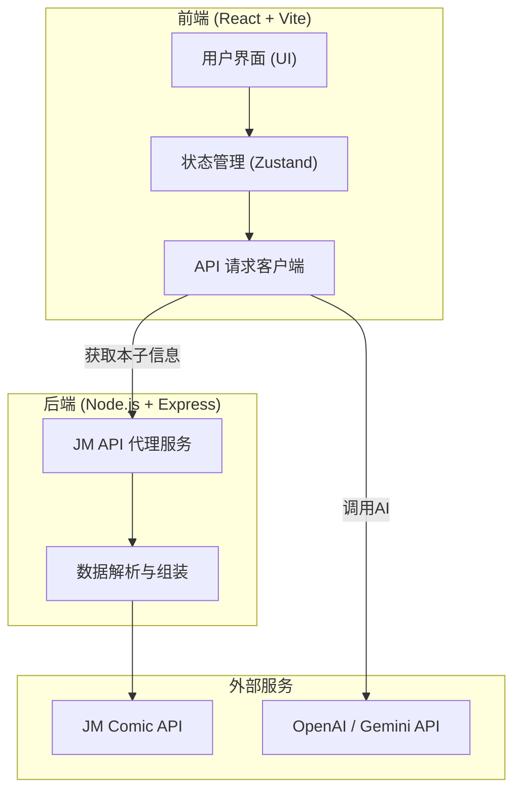

## 1. 架构设计


## 2. 技术栈说明
- **前端**：React 18 + Vite + TypeScript + Tailwind CSS
- **UI 组件库**：shadcn/ui (Radix UI) + Lucide Icons
- **Markdown 渲染**：react-markdown + remark-gfm
- **状态管理**：Zustand (用于持久化保存AI配置和用户偏好)
- **后端**：Node.js + Express + Axios + Cheerio (若需要解析HTML) / 直接调用JM API

## 3. 路由定义 (前端)
由于是单页应用，无需复杂路由，主要通过组件状态切换：
| 路由 | 用途 |
|-------|---------|
| `/` | 主界面，包含搜索、配置、结果展示 |

## 4. API 定义 (后端)
后端主要用于解决JM API的跨域问题及数据组装。
### 4.1 搜索本子
- **Endpoint**: `/api/jm/search`
- **Method**: `GET`
- **Query**: `keyword` (字符串，名称或JM号)
- **Response**: 
  ```json
  {
    "success": true,
    "data": [
      {
        "id": "12345",
        "title": "测试本子",
        "image": "https://...",
        "isJmId": false
      }
    ]
  }
  ```

### 4.2 获取本子详情与评论
- **Endpoint**: `/api/jm/details/:id`
- **Method**: `GET`
- **Response**:
  ```json
  {
    "success": true,
    "data": {
      "id": "12345",
      "title": "测试本子",
      "description": "简介内容...",
      "tags": ["纯爱", "后宫"],
      "comments": [
        "好评如潮",
        "画风不错"
      ]
    }
  }
  ```

## 5. 数据流向说明
前端直接调用 AI API（配置保存在本地），避免后端存储敏感的 API Key。
后端仅作为 JM Comic API 的代理，隐藏复杂的签名和请求头逻辑，返回干净的 JSON 数据给前端。